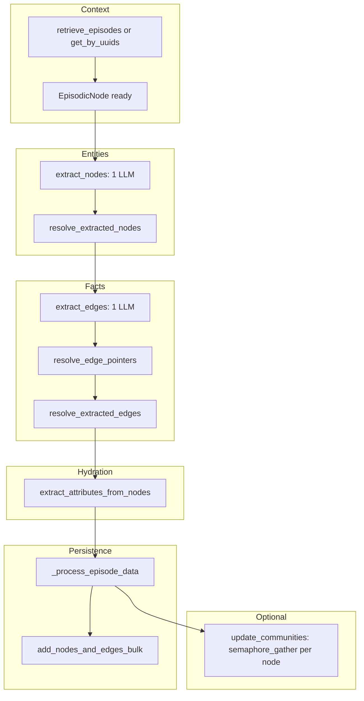

# Episode to graph: nodes, edges, and persistence

This document describes how a single episode is turned into **entity nodes**, **entity edges**, **episodic nodes/edges**, and written to the database, following [`Graphiti.add_episode`](../graphiti_core/graphiti.py#L921). The flow is **mostly sequential** between major stages; concurrency appears inside specific stages via [`semaphore_gather`](../graphiti_core/helpers.py#L130).

## Summary

1. **Context** — Load previous episodes (or use `previous_episode_uuids`), build or load the [`EpisodicNode`](../graphiti_core/nodes.py).
2. **Entities** — One LLM call extracts candidate [`EntityNode`](../graphiti_core/nodes.py) objects ([`extract_nodes`](../graphiti_core/utils/maintenance/node_operations.py#L65)).
3. **Dedupe** — For each extracted name, embedding + vector DB candidate retrieval runs in two bounded waves ([`resolve_extracted_nodes`](../graphiti_core/utils/maintenance/node_operations.py#L490) → [`_semantic_candidate_search`](../graphiti_core/utils/maintenance/node_operations.py#L289)). Deterministic similarity may resolve nodes; remaining cases go through one batched LLM dedupe call.
4. **Facts** — One LLM call extracts [`EntityEdge`](../graphiti_core/edges.py) candidates from the episode plus the **extracted** entity list ([`extract_edges`](../graphiti_core/utils/maintenance/edge_operations.py#L88)); see [Why you can have nodes but no `EntityEdge`](#why-you-can-have-nodes-but-no-entityedge). Edge UUIDs are remapped through the node dedupe map ([`resolve_edge_pointers`](../graphiti_core/utils/bulk_utils.py#L555)).
5. **Edge resolution** — Embeddings for facts (batch), then several `semaphore_gather` waves over edges: load edges between endpoints, hybrid [`search`](../graphiti_core/search/search.py#L155) per edge for related and invalidation candidates, per-edge LLM resolution, then re-embed resolved/invalidated edges ([`resolve_extracted_edges`](../graphiti_core/utils/maintenance/edge_operations.py#L248)).
6. **Hydration** — Parallel per-node attribute LLM calls, then parallel “flights” of batch summarization where needed, then batch name embeddings ([`extract_attributes_from_nodes`](../graphiti_core/utils/maintenance/node_operations.py#L589)).
7. **Save** — Build episodic mention edges ([`build_episodic_edges`](../graphiti_core/utils/maintenance/edge_operations.py#L50)), then one transactional bulk write: ensure embeddings, persist episode, episodic edges, entities, and entity edges ([`add_nodes_and_edges_bulk`](../graphiti_core/utils/bulk_utils.py#L128) / [`_process_episode_data`](../graphiti_core/graphiti.py#L634)).
8. **Optional** — If `update_communities` is true, one `semaphore_gather` runs `update_community` per resolved node (capped by `max_coroutines`) ([`add_episode`](../graphiti_core/graphiti.py#L1167)).

**Concurrency notation** — `A×B` means **stage A** schedules up to `A` concurrent tasks (subject to the semaphore cap), then **stage B** schedules up to `B` concurrent tasks after A completes. It does **not** mean `A×B` tasks run at once unless those stages overlap in code (they usually do not). The global default cap for `semaphore_gather` when `max_coroutines` is omitted is **`SEMAPHORE_LIMIT`** (env, default **20** in [`helpers.py`](../graphiti_core/helpers.py#L38)). Edge resolution passes **`driver.max_coroutines`** when set.

## Why you can have nodes but no `EntityEdge`

This is normal in the current design: **node persistence does not depend on producing any entity–entity edges.** Only [`EntityEdge`](../graphiti_core/edges.py) rows are absent; you still get **episodic** structure (episode node + [`EpisodicEdge`](../graphiti_core/utils/maintenance/edge_operations.py#L55) from episode to each entity) when entities exist.

### Where it arises in the pipeline

1. **Entities are produced and saved independently of edges**  
   [`add_episode`](../graphiti_core/graphiti.py#L1077) calls [`extract_nodes`](../graphiti_core/utils/maintenance/node_operations.py#L65) then [`resolve_extracted_nodes`](../graphiti_core/graphiti.py#L1092). Those steps can yield a non-empty `nodes` list. Later, [`_process_episode_data`](../graphiti_core/graphiti.py#L1150) always calls [`add_nodes_and_edges_bulk`](../graphiti_core/graphiti.py#L673) with that node list and whatever `entity_edges` list was built—even if that list is **empty** (see [`entity_edges`](../graphiti_core/graphiti.py#L1153) flowing from [`resolved_edges + invalidated_edges`](../graphiti_core/graphiti.py#L1129)).

2. **Edge extraction is a separate LLM step with strict validation**  
   [`_extract_and_resolve_edges`](../graphiti_core/graphiti.py#L610) calls [`extract_edges`](../graphiti_core/utils/maintenance/edge_operations.py#L88) with the **pre-dedupe** [`extracted_nodes`](../graphiti_core/graphiti.py#L1112) as the `nodes` argument. Inside [`extract_edges`](../graphiti_core/utils/maintenance/edge_operations.py#L127), [`name_to_node`](../graphiti_core/utils/maintenance/edge_operations.py#L127) is keyed by **exact** `EntityNode.name` strings from that list (duplicate names in one episode would **collapse** to one dict entry). The model must emit [`source_entity_name` / `target_entity_name`](../graphiti_core/utils/maintenance/edge_operations.py#L151) that match those keys **character-for-character**. If it uses a synonym, nickname, typo, or a name that was never in the extracted set, the edge is [**dropped**](../graphiti_core/utils/maintenance/edge_operations.py#L154) with a warning.

3. **Self-edges and empty facts never become `EntityEdge` rows**  
   Same function: [**self-edges**](../graphiti_core/utils/maintenance/edge_operations.py#L169) (source and target resolve to the same UUID) are skipped, and edges with a [**blank `fact`**](../graphiti_core/utils/maintenance/edge_operations.py#L196) are skipped in the conversion loop.

4. **LLM returns no usable edges**  
   If every candidate is filtered out, [`edges_data`](../graphiti_core/utils/maintenance/edge_operations.py#L149) stays empty and the function [**returns `[]` immediately**](../graphiti_core/utils/maintenance/edge_operations.py#L184) — no DB involvement yet, so this is not a storage bug.

5. **Downstream steps tolerate an empty edge list**  
   [`resolve_edge_pointers`](../graphiti_core/utils/bulk_utils.py#L555) on an empty list is a no-op. [`resolve_extracted_edges`](../graphiti_core/utils/maintenance/edge_operations.py#L248) still runs; with zero edges, `asyncio.gather` completes with no work and you get empty resolved / invalidated / new edge lists ([`semaphore_gather`](../graphiti_core/helpers.py#L141) over zero tasks returns `[]`).

6. **Hydration and episodic edges still use nodes**  
   [`extract_attributes_from_nodes`](../graphiti_core/graphiti.py#L1135) receives [`edges=new_edges`](../graphiti_core/graphiti.py#L1140); an empty list only means summaries do not get extra fact text from new edges. [`build_episodic_edges`](../graphiti_core/graphiti.py#L667) still creates one [`EpisodicEdge`](../graphiti_core/utils/maintenance/edge_operations.py#L55) per **hydrated** entity from episode to entity.

### Takeaway

Seeing **entity nodes on disk with zero `EntityEdge`** usually means the **edge extraction / validation** stage produced nothing usable (model output, name alignment, self-loop, or empty fact)—not a failure of node insert or dedupe.

## Mermaid flow

## Concurrency by stage

Let **N** = number of extracted entities after filtering, **E** = number of extracted edges after validation/dedup inside `extract_edges`, **K** = effective semaphore limit (`min(task_count, SEMAPHORE_LIMIT)` or `min(task_count, driver.max_coroutines)` where passed), **F** = number of summary “flights” (`ceil(nodes_needing_llm / 30)`; see `MAX_NODES` in [`node_operations.py`](../graphiti_core/utils/maintenance/node_operations.py#L58)).

| Stage | Location | Pattern |
|--------|-----------|---------|
| Node dedup search | [`_semantic_candidate_search`](../graphiti_core/utils/maintenance/node_operations.py#L289) | If embedder has `create_batch`: one batch embed, then **N×N** as two waves of `semaphore_gather` (each wave size N, each capped by K). If no batch: first wave N concurrent single-query embeds, second wave N concurrent `node_similarity_search` — still **N×N** structurally. |
| Edge load + search + LLM | [`resolve_extracted_edges`](../graphiti_core/utils/maintenance/edge_operations.py#L248) | Four sequential outer waves, each up to **E** concurrent tasks (cap K): **E** `get_between_nodes`; **E** `search` where each call does **4** parallel scope queries internally (**E×4**); **E** `search` again (**E×4**); **E** `resolve_extracted_edge` LLM. |
| Edge embed refresh | end of [`resolve_extracted_edges`](../graphiti_core/utils/maintenance/edge_operations.py#L454) | One `semaphore_gather` with **2** tasks (resolved vs invalidated embedding batches). |
| Attributes | [`extract_attributes_from_nodes`](../graphiti_core/utils/maintenance/node_operations.py#L589) | **N** concurrent `_extract_entity_attributes` (default K), then **F** concurrent `_process_summary_flight` (each flight is one batched LLM), then batch `create_entity_node_embeddings` (no per-node gather). |
| Bulk save | [`add_nodes_and_edges_bulk_tx`](../graphiti_core/utils/bulk_utils.py#L151) | Sequential per-node / per-edge embedding fill if missing, then bulk driver writes — **not** N-wide gather. |
| Communities | [`add_episode`](../graphiti_core/graphiti.py#L1167) when `update_communities` | **N** tasks `update_community`, `max_coroutines=self.max_coroutines`. |

**Total concurrent footprint** — There is no single global “multiply all stages” number: each stage uses the same semaphore pattern, so at any instant in-node-dedup you are bounded by **K**, in edge resolution by **K**, etc. Worst-case *overlap across stages* is limited because [`add_episode`](../graphiti_core/graphiti.py#L1025) awaits each stage before the next. (A docstring there still mentions running edge extraction “in parallel” with attribute extraction; the implementation is **sequential**: edges resolve first, then attributes.)

## Key code references (clickable from `docs/`)

Orchestration:

- [`Graphiti.add_episode`](../graphiti_core/graphiti.py#L921) — main entry
- [`Graphiti._extract_and_resolve_edges`](../graphiti_core/graphiti.py#L588) — `extract_edges` → `resolve_edge_pointers` → `resolve_extracted_edges`
- [`Graphiti._process_episode_data`](../graphiti_core/graphiti.py#L634) — episodic edges, bulk save, optional saga

Nodes:

- [`extract_nodes`](../graphiti_core/utils/maintenance/node_operations.py#L65) — LLM entity extraction; [empty-name filter](../graphiti_core/utils/maintenance/node_operations.py#L93)
- [`resolve_extracted_nodes`](../graphiti_core/utils/maintenance/node_operations.py#L490)
- [`_semantic_candidate_search`](../graphiti_core/utils/maintenance/node_operations.py#L289) — embed + similarity waves
- [`extract_attributes_from_nodes`](../graphiti_core/utils/maintenance/node_operations.py#L589)

Edges (including “nodes but no entity edges”):

- [`extract_edges`](../graphiti_core/utils/maintenance/edge_operations.py#L88) — LLM edge extraction
- [Name validation loop](../graphiti_core/utils/maintenance/edge_operations.py#L148) — drops unknown source/target names
- [Self-edge drop](../graphiti_core/utils/maintenance/edge_operations.py#L169)
- [Empty `fact` skip](../graphiti_core/utils/maintenance/edge_operations.py#L196)
- [Early return when no edges](../graphiti_core/utils/maintenance/edge_operations.py#L184)
- [`resolve_extracted_edges`](../graphiti_core/utils/maintenance/edge_operations.py#L248)
- [`build_episodic_edges`](../graphiti_core/utils/maintenance/edge_operations.py#L50) — episode → entity links (still created without `EntityEdge`)

Persistence and helpers:

- [`resolve_edge_pointers`](../graphiti_core/utils/bulk_utils.py#L555)
- [`add_nodes_and_edges_bulk`](../graphiti_core/utils/bulk_utils.py#L128)
- [`add_nodes_and_edges_bulk_tx`](../graphiti_core/utils/bulk_utils.py#L151)
- [`search` hybrid scopes](../graphiti_core/search/search.py#L155) — four parallel scopes per call
- [`semaphore_gather`](../graphiti_core/helpers.py#L130), [`SEMAPHORE_LIMIT`](../graphiti_core/helpers.py#L38)
